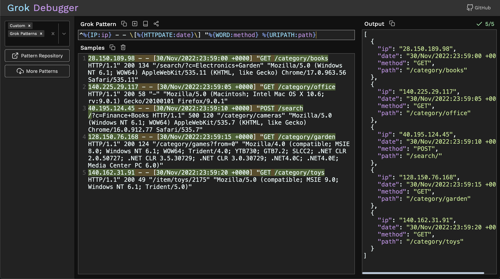

[grokdebugger.com](https://www.grokdebugger.com)

This client-side application uses WebAssembly to run PCRE RegEx in the browser to help you debug your Grok patterns.

**Features:** 
- Real-time processing (see changes as you type)
- Autocomplete
- Match highlighting
- Syntax highlighting
- Debug multiple lines at once
- A dozen pattern sets (Grok, firewalls, Java, HAProxy, etc.)
- Save patterns and load them later (uses browser localstorage)

